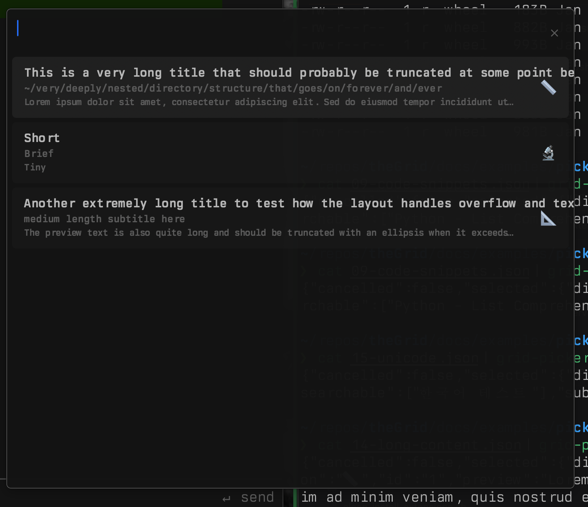
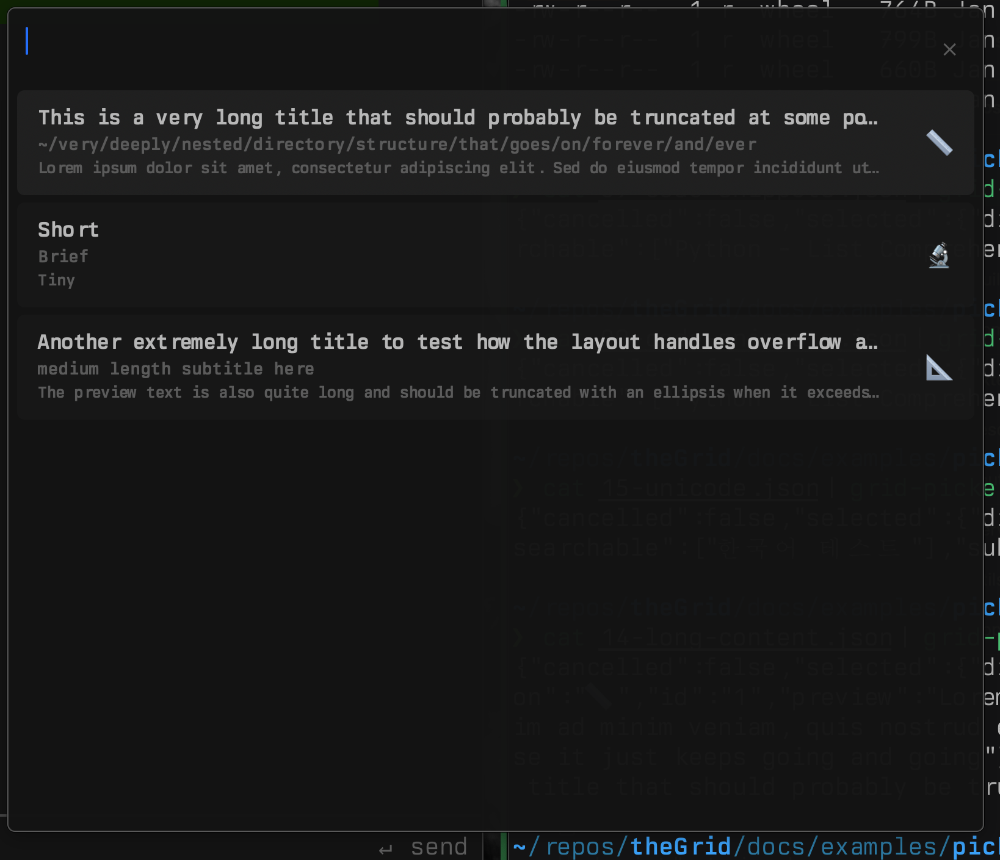

# Debug Flow Example: Picker Text Overflow Fix

## Summary: How Code-Foundations Guided This Fix

This document demonstrates how the `code-foundations` skill structured a debugging session, leading to a clean, systematic fix rather than an ad-hoc patch.

### What the Skill Did

**1. Task Classification**
The skill immediately classified this as a DEBUG task. This framing matters - it signals "find the root cause" rather than "make it work somehow."

**2. Root Cause Analysis (Not Symptom Chasing)**
Instead of jumping to a fix, the skill examined the draw implementation and produced a comparative analysis:

| Element  | Current              | Problem                         |
|----------|----------------------|---------------------------------|
| Title    | `.draw(at:)`         | No width constraint - overflows |
| Subtitle | `.draw(at:)`         | No width constraint - overflows |
| Preview  | `.draw(in:)` with rect | Already correct              |

This table reveals the pattern: the codebase already had the correct solution for preview text. The bug wasn't "how do we truncate text?" but "why aren't title/subtitle using the same pattern as preview?"

**3. Surgical Fix**
With the root cause clear, the fix was minimal:
- Apply the existing `.draw(in:)` pattern to title and subtitle
- Add a margin for visual breathing room

### What Could Have Gone Wrong Without This Approach

A typical ad-hoc debug might have:
- **Hacked a width check** - Adding `if text.count > 50 { truncate }` would "fix" it but miss the real issue
- **Missed the existing pattern** - The preview was already doing truncation correctly; without systematic analysis, you might reinvent a worse solution
- **Over-engineered** - Adding a whole text truncation utility when `NSParagraphStyle.byTruncatingTail` already exists
- **Under-fixed** - Only fixing title, forgetting subtitle has the same issue

### The Methodology

```
Classify Task → Read Relevant Code → Identify Pattern/Root Cause → Apply Minimal Fix → Verify Build
```

Total time: 57 seconds. The structured approach wasn't slower - it was faster because it avoided false starts and rework.

---

## Before & After

### Before (text overflows into icon)


### After (text truncates cleanly)


---

## Full Session Transcript

```
> perfect, can you now use your code-foundation skills and help me fix a problem.
> When the picker has long text, it runs over the icons. can we please make the
> text cut off before it hits the icon? Maybe even a small margin before then.

Skill(code-foundations:code-foundations)
  Successfully loaded skill

Task Classification: DEBUG - fixing text overflow bug.

Let me examine the current draw implementation to identify the root cause.

Read(grid-server/Sources/GridPicker/main.swift)
  Read 50 lines

Root Cause Identified:
┌──────────┬──────────────────────┬─────────────────────────────────┐
│ Element  │       Current        │             Problem             │
├──────────┼──────────────────────┼─────────────────────────────────┤
│ Title    │ .draw(at:)           │ No width constraint - overflows │
├──────────┼──────────────────────┼─────────────────────────────────┤
│ Subtitle │ .draw(at:)           │ No width constraint - overflows │
├──────────┼──────────────────────┼─────────────────────────────────┤
│ Preview  │ .draw(in:) with rect │ ✓ Correctly constrained         │
└──────────┴──────────────────────┴─────────────────────────────────┘

Fix: Use .draw(in:) with truncation for title and subtitle, plus add margin before icon.

Update(grid-server/Sources/GridPicker/main.swift)
  Added 3 lines, removed 2 lines
    776          // Text starts at left padding within card
    777          let textStartX = Self.cardInset + Self.horizontalPadding
    778
    779 -        // Text ends before icon column (icon now on right)
    779 +        // Text ends before icon column (icon now on right) with margin
    780 +        let iconMargin: CGFloat = 12
    781          let textEndX: CGFloat
    782          if showIconColumn {
    782 -            textEndX = bounds.width - Self.cardInset - Self.horizontalPadding - Self.iconColumnWidth
    783 +            textEndX = bounds.width - Self.cardInset - Self.horizontalPadding - Self.iconColumnWidth - iconMargin
    784          } else {
    785              textEndX = bounds.width - Self.cardInset - Self.horizontalPadding
    786          }

Now fix title and subtitle to use truncating draw.

Update(grid-server/Sources/GridPicker/main.swift)
  Added 13 lines, removed 11 lines
    797          // Track Y position (drawing from top to bottom, but NSView coordinates are bottom-up)
    798          var currentY = cardRect.maxY - Self.verticalPadding
    799
    800 -        // Draw title with highlighting
    800 +        // Draw title with highlighting (truncated to fit)
    801          let titleString = buildTitleAttributedString()
    802 -        let titleHeight = titleString.size().height
    803 -        currentY -= titleHeight
    804 -        titleString.draw(at: NSPoint(x: textStartX, y: currentY))
    805 -        currentY -= (Self.titleLineHeight - titleHeight)
    802 +        currentY -= Self.titleLineHeight
    803 +        let titleRect = NSRect(x: textStartX, y: currentY, width: textWidth, height: Self.titleLineHeight)
    804 +        titleString.draw(in: titleRect)
    805
    807 -        // Draw subtitle if present
    806 +        // Draw subtitle if present (truncated to fit)
    807          if let subtitle = item.subtitle {
    808 +            let paragraphStyle = NSMutableParagraphStyle()
    809 +            paragraphStyle.lineBreakMode = .byTruncatingTail
    810 +
    811              let subtitleString = NSAttributedString(
    812                  string: subtitle,
    813                  attributes: [
    814                      .font: Fonts.mono(size: 14),
    813 -                    .foregroundColor: Colors.placeholder
    815 +                    .foregroundColor: Colors.placeholder,
    816 +                    .paragraphStyle: paragraphStyle
    817                  ]
    818              )
    816 -            let subtitleHeight = subtitleString.size().height
    817 -            currentY -= subtitleHeight
    818 -            subtitleString.draw(at: NSPoint(x: textStartX, y: currentY))
    819 -            currentY -= (Self.subtitleLineHeight - subtitleHeight)
    819 +            currentY -= Self.subtitleLineHeight
    820 +            let subtitleRect = NSRect(x: textStartX, y: currentY, width: textWidth, height: Self.subtitleLineHeight)
    821 +            subtitleString.draw(in: subtitleRect)
    822          }
    823
    824          // Draw preview if present (truncated)

Now update buildTitleAttributedString() to include truncation paragraph style.

Read(grid-server/Sources/GridPicker/main.swift)
  Read 30 lines

Update(grid-server/Sources/GridPicker/main.swift)
  Added 5 lines, removed 1 line
    843      /// Build the title attributed string with match highlighting
    844      private func buildTitleAttributedString() -> NSAttributedString {
    845          let displayText = item.title
    846 +        let paragraphStyle = NSMutableParagraphStyle()
    847 +        paragraphStyle.lineBreakMode = .byTruncatingTail
    848 +
    849          let attributedString = NSMutableAttributedString(
    850              string: displayText,
    851              attributes: [
    852                  .font: Fonts.mono(size: 17),
    850 -                .foregroundColor: Colors.text
    853 +                .foregroundColor: Colors.text,
    854 +                .paragraphStyle: paragraphStyle
    855              ]
    856          )
    857

Bash(swift build --package-path grid-server --product grid-picker 2>&1)
  [0/1] Planning build
  Building for debugging...
  [0/4] Write sources
  ... +26 lines

Build successful.

Fix Summary
┌─────────────────────┬─────────────────────────────────────────────────────────────┐
│       Change        │                         Description                         │
├─────────────────────┼─────────────────────────────────────────────────────────────┤
│ Icon margin         │ Added 12pt gap between text and icon                        │
├─────────────────────┼─────────────────────────────────────────────────────────────┤
│ Title truncation    │ Changed from .draw(at:) to .draw(in:) with byTruncatingTail │
├─────────────────────┼─────────────────────────────────────────────────────────────┤
│ Subtitle truncation │ Changed from .draw(at:) to .draw(in:) with byTruncatingTail │
├─────────────────────┼─────────────────────────────────────────────────────────────┤
│ Preview             │ Already correct (no change needed)                          │
└─────────────────────┴─────────────────────────────────────────────────────────────┘

Long text will now truncate with "..." before reaching the icon column.

Brewed for 57s
```
