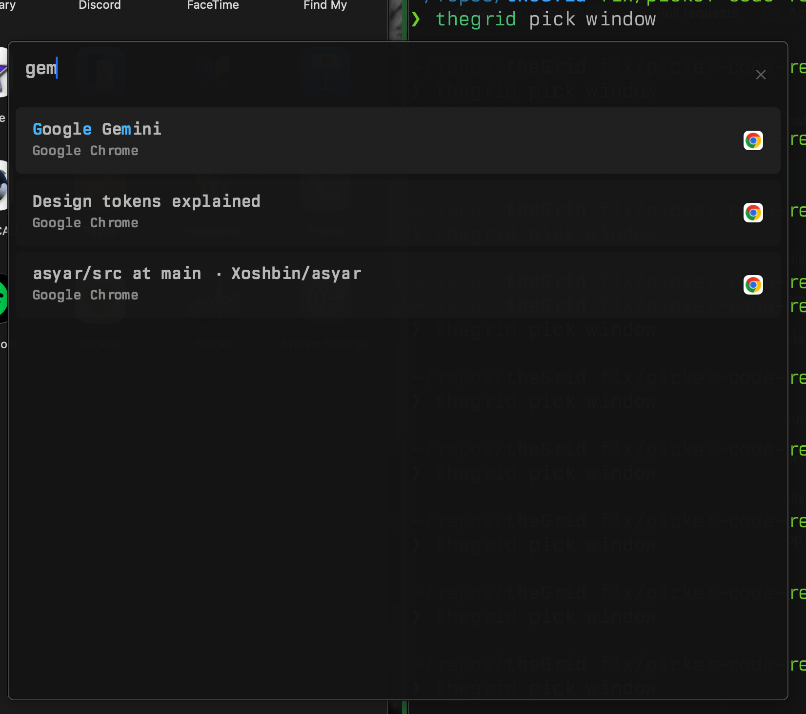

# Prerequisites Example: Window Picker Integration Plan



## Summary: How CC-Construction-Prerequisites Guided This Plan

This document demonstrates how the `cc-construction-prerequisites` skill produced a structured, checkpoint-gated implementation plan instead of diving straight into code.

### What the Skill Did

**1. Established Clear Objective**
Before any implementation details, the plan states exactly what success looks like: "fuzzy window selection that focuses the chosen window and warps the mouse cursor to it."

**2. Phased Decomposition**
Instead of a monolithic task, the work is broken into 5 discrete phases:

| Phase | Objective | Why Separate |
|-------|-----------|--------------|
| 1 | Command structure | Establishes CLI foundation before logic |
| 2 | Window list generation | Pure data transformation, testable in isolation |
| 3 | Picker invocation | IPC complexity isolated from business logic |
| 4 | Focus + mouse warp | Depends on phases 2-3 working |
| 5 | Hotkey integration | Optional enhancement, not blocking core feature |

**3. Checkpoint Gates Between Phases**
Each phase has a validation checkpoint before proceeding:

- **Build Gate** - Compilation must pass
- **Test Validation** - Unit tests verify component correctness
- **Capability Proof** - Manual verification that the picker can be invoked
- **Integration Test** - End-to-end workflow validation
- **Code Review** - Pattern adherence check

This prevents "Phase 4 discovers Phase 2 was wrong" scenarios.

**4. Explicit Inputs/Outputs**
Each phase declares what it needs and what it produces. This makes handoffs clear and parallelization possible.

**5. Risk Register**
Identified risks upfront with mitigations:

| Risk | Mitigation |
|------|------------|
| Binary not found | Check multiple locations, clear error message |
| Window closed between selection | Handle gracefully, inform user |
| App icons hard to determine | Use default icon for MVP, enhance later |

### What Could Have Gone Wrong Without This Approach

A typical "just start coding" approach might have:
- **Built focus logic first** - Then discovered the picker invocation doesn't work
- **Hardcoded paths** - Risk register called out the xdg package requirement
- **No validation gates** - Built all 5 phases, then discovered Phase 2's JSON doesn't match picker's schema
- **Scope creep** - Added icon detection complexity in Phase 2 instead of deferring to "enhance later"
- **Missing error handling** - "Window closed between selection" is a real edge case that's easy to forget

### The Methodology

```
Define Objective → Decompose Phases → Add Checkpoints → Identify Risks → Document Assumptions
```

The 1m 52s spent planning saves hours of rework. Each checkpoint is a "safe save point" - if something fails, you know exactly where to return.

---

## The Plan

```
Plan: Window Picker Integration

Objective

Integrate grid-picker with thegrid CLI to enable fuzzy window selection that focuses
the chosen window and warps the mouse cursor to it.

---
Phase 1: Add pick Command Structure to CLI

Objective: Create extensible command hierarchy for picker functionality

Agent: Implementation agent with Go/cobra expertise

Work:
1. Add new pickCmd parent command to grid-cli/cmd/grid/main.go
2. Create pick windows subcommand that will invoke the picker
3. Wire up standard flags (--json, --socket, --timeout)

Inputs:
- Existing command patterns in main.go (see pingCmd, focusCmd)

Outputs:
- thegrid pick command group exists
- thegrid pick --help shows available subcommands
- thegrid pick windows runs (even if stub)

Validation:
- thegrid pick --help displays help
- No compilation errors

---
Checkpoint: Build Gate

Type: Build/Lint Gate

Verifies: Code compiles and follows patterns

Pass Criteria:
- go build ./... succeeds
- No new lint warnings

If Fails: Fix compilation errors before proceeding

---
Phase 2: Implement Window List Generation

Objective: Create function to generate picker-compatible JSON from tileable windows

Agent: Implementation agent with Go expertise

Work:
1. Create new file grid-cli/internal/picker/windows.go
2. Implement GenerateWindowItems(snap *server.Snapshot, exclusions config.WindowExclusion) []PickerItem
3. Map WindowInfo → PickerItem with:
  - id: window ID as string
  - title: window title (or app name if title empty)
  - subtitle: app name / bundle ID
  - icon: emoji based on app (can use a simple map, or just "🪟" default)
  - metadata.windowId: original window ID for selection handling

Inputs:
- server.Snapshot with tileable windows
- PickerItem JSON schema from grid-picker

Outputs:
- picker/windows.go with GenerateWindowItems() function
- PickerItem struct definition matching grid-picker's expected format

Validation:
- Unit test that creates mock snapshot and verifies JSON output matches picker schema

---
Checkpoint: Test Validation

Type: Test Validation

Verifies: Window list generation produces valid picker JSON

Pass Criteria:
- go test ./internal/picker/... passes
- Output JSON matches picker schema

If Fails: Return to Phase 2

---
Phase 3: Implement Picker Invocation

Objective: Wire pick windows command to invoke grid-picker with window list

Agent: Implementation agent

Work:
1. In pickWindowsCmd.RunE:
  - Fetch server snapshot
  - Generate window items JSON
  - Locate grid-picker binary (check PATH, then ~/.local/state/thegrid/GridServer.app/Contents/MacOS/grid-picker)
  - Spawn grid-picker process with JSON piped to stdin
  - Parse stdout for selected item
2. Handle exit codes: 0 = selected, 1 = cancelled
3. Extract window ID from selection result

Inputs:
- Window items JSON from Phase 2
- grid-picker binary location

Outputs:
- pick windows launches picker with correct window list
- Selection result parsed and window ID extracted

Validation:
- Manual test: run thegrid pick windows, see picker, select window, see parsed result in logs

---
Checkpoint: Capability Proof

Type: Capability Proof

Proves: Picker can be invoked from CLI and selection returned

Minimal Test:
1. Run thegrid pick windows
2. Verify picker window appears with window list
3. Select a window, verify selection JSON printed to debug log
4. Press ESC, verify cancelled state handled

Pass Criteria:
- Picker launches with windows visible
- Selection returns correct window ID
- Cancellation handled gracefully (no crash, exit 0)

If Fails: Debug picker invocation before adding focus logic

---
Phase 4: Implement Focus + Mouse Warp

Objective: Complete the workflow by focusing selected window and warping mouse

Agent: Implementation agent

Work:
1. After successful selection:
  - Call focus.FocusWindow(ctx, client, windowID)
  - Call mouse.WarpToWindow(ctx, client, windowID)
2. Handle errors gracefully (window may have closed)
3. Output result (JSON or human-readable based on --json flag)

Inputs:
- Window ID from picker selection
- Existing focus.FocusWindow() and mouse.WarpToWindow() functions

Outputs:
- Selected window is focused
- Mouse cursor moves to window center
- Success/error output displayed

Validation:
- End-to-end test: thegrid pick windows, select window, verify focus AND mouse moved

---
Checkpoint: Integration Test

Type: Integration Check

Verifies: Full workflow from invocation to focus

Pass Criteria:
- thegrid pick windows → select → window focuses
- Mouse cursor is at center of selected window
- Works with windows on different displays
- Cancellation returns exit 0 (no error)

If Fails: Return to Phase 4

---
Phase 5: Add BFD Hotkey Integration

Objective: Enable triggering window picker via keyboard shortcut

Agent: Implementation agent

Work:
1. Add example hotkey to bfd.yaml documentation:
hotkeys:
  ctrl-space: ${grid} pick windows
2. Test that BFD correctly spawns the picker
3. Document in README or CLAUDE.md

Inputs:
- BFD hotkey configuration format
- thegrid pick windows command

Outputs:
- Example hotkey config documented
- BFD can trigger picker via hotkey

Validation:
- Press ctrl-space (or configured hotkey), picker appears

---
Checkpoint: Code Review

Type: Code Review

Verifies: Implementation follows project patterns and code-foundations principles

Pass Criteria:
- No unnecessary abstractions (direct implementation)
- Error handling follows existing patterns
- Logging uses jsonlog consistently
- No hardcoded paths (use xdg package)
- Comments explain "why" not "what"

If Fails: Address review feedback before final validation

---
Execution Order

Phase 1: Add pick command structure
    ↓
Checkpoint: Build Gate
    ↓
Phase 2: Implement window list generation
    ↓
Checkpoint: Test Validation
    ↓
Phase 3: Implement picker invocation
    ↓
Checkpoint: Capability Proof
    ↓
Phase 4: Focus + mouse warp
    ↓
Checkpoint: Integration Test
    ↓
Phase 5: BFD hotkey
    ↓
Checkpoint: Code Review

---
Risk Register
┌───────────────────────────────────────────┬────────────┬───────────────────────────────────────────────────────┐
│                   Risk                    │ Likelihood │                      Mitigation                       │
├───────────────────────────────────────────┼────────────┼───────────────────────────────────────────────────────┤
│ grid-picker binary not found              │ Medium     │ Check multiple locations, provide clear error message │
├───────────────────────────────────────────┼────────────┼───────────────────────────────────────────────────────┤
│ Window closed between selection and focus │ Low        │ Handle error gracefully, inform user                  │
├───────────────────────────────────────────┼────────────┼───────────────────────────────────────────────────────┤
│ Picker stdin/stdout parsing fails         │ Low        │ Use JSON strictly, test edge cases                    │
├───────────────────────────────────────────┼────────────┼───────────────────────────────────────────────────────┤
│ App icons hard to determine               │ Medium     │ Use default icon "🪟" for MVP, enhance later          │
└───────────────────────────────────────────┴────────────┴───────────────────────────────────────────────────────┘
---
Assumptions

- grid-picker binary is deployed with GridServer.app
- Server is running and accessible via socket
- Window list fits in memory (reasonable assumption for typical desktop use)
- User expects picker to cancel on ESC or focus loss (existing picker behavior)
```

---

## Part 2: Using the Skill to Review the Plan

The same skill that generated the plan can also review it against code-foundations principles.

### Review Request

```
User: looks great. there are some things around where will some of these settings
      be stored in the config so it's easy to change. things like path to
      grid-picker binary, etc. but we can come back to that. can you please do
      a review on this plan using code-foundations?

I'll invoke the construction prerequisites skill to review this plan against
code-foundations principles.

Skill(code-foundations:cc-construction-prerequisites)
  Successfully loaded skill

Let me review the checklist to properly assess the plan.

Read(~/.claude/plugins/cache/rtd/code-foundations/1.5.0/skills/cc-construction-prerequisites/checklists.md)
  Read 192 lines
```

### The Review Output

The skill applied **CHECKER mode** - a structured review against the construction prerequisites checklist.

#### Requirements Checklist

| Item | Status | Evidence | Gap/Note |
|------|--------|----------|----------|
| [CORE] Tasks user wants to perform specified | PASS | "invoke thegrid pick windows, see fuzzy list, select, focus + mouse warp" | Clear user workflow |
| [CORE] Data for each task specified | WARNING | Input: tileable windows. Output: focused window. But picker item format not fully specified | Need to define: what exactly does metadata contain? How is windowId passed back? |
| [CORE] Definition of success/failure | PASS | Success = window focused + mouse warped. Failure = graceful exit on cancel/error | Risk register covers failures |
| [CORE] Requirements clear to independent group | WARNING | Plan is clear but no explicit data contract between CLI and picker | Picker JSON schema referenced but not documented in plan |
| [CORE] Each requirement testable | PASS | Checkpoints include specific pass criteria | Capability proof and integration test defined |
| [STANDARD] Inputs specified | WARNING | "Tileable windows from snapshot" - but exclusions handling not specified | Should config exclusions affect picker list? |
| [STANDARD] Outputs specified | PASS | JSON output on --json, human-readable otherwise | Matches existing CLI patterns |

#### Architecture Checklist

| Item | Status | Evidence | Gap/Note |
|------|--------|----------|----------|
| [CORE] Overall organization clear | PASS | CLI → picker process → parse result → focus/warp | Unix pipes model, clear data flow |
| [CORE] Major building blocks defined | WARNING | picker/windows.go defined, but where does PickerItem struct live? | Plan says "create PickerItem struct" but doesn't specify package location |
| [CORE] Error-handling strategy | WARNING | "Handle errors gracefully" mentioned but no specific strategy | What happens if: picker binary missing? Focus fails? Window closed during selection? |
| [CORE] Implementer comfortable | PASS | Architecture matches existing patterns (cobra commands, client calls) | Follows established conventions |
| [STANDARD] Functions covered by building blocks | PASS | Each phase maps to specific functionality | No gaps in coverage |
| [STANDARD] Most critical classes described | WARNING | PickerItem mentioned but not fully specified | Need field-level definition |
| [STANDARD] Architecture accommodates changes | PASS | pick subcommand structure allows future pickers | Extensibility addressed |

#### Upstream Prerequisites

| Item | Status | Evidence | Gap/Note |
|------|--------|----------|----------|
| [CORE] Project type identified | PASS | Feature addition to existing CLI tool | Approach tailored appropriately |
| [CORE] Requirements stable enough | PASS | User confirmed command structure, display format, hotkey scope | Clear direction |
| [CORE] Architecture sufficiently defined | WARNING | High-level flow clear, but config integration not addressed | User mentioned "where settings are stored" as future concern |
| [CORE] Project-specific risks addressed | PASS | Risk register includes binary location, window closure, parsing | Key risks identified |

#### Construction Practices

| Item | Status | Evidence | Gap/Note |
|------|--------|----------|----------|
| [CORE] Coding conventions defined | PASS | Project uses existing conventions (jsonlog, cobra patterns) | Follows CLAUDE.md |
| [CORE] Revision control selected | PASS | Git, on branch fix/picker-code-review-issues | Already in use |
| [CORE] Language/version selected | PASS | Go for CLI, Swift for picker (existing) | No changes |
| [STANDARD] Integration procedure | WARNING | Checkpoints defined but no pre-commit steps specified | Should run go test, go build before commit |
| [STANDARD] Unit tests planned | PASS | Phase 2 includes "Unit test that creates mock snapshot" | Test validation checkpoint |

#### Summary

| Category | PASS | WARNING | VIOLATION |
|----------|------|---------|-----------|
| Requirements | 4 | 3 | 0 |
| Architecture | 4 | 4 | 0 |
| Upstream Prerequisites | 3 | 1 | 0 |
| Construction Practices | 4 | 1 | 0 |
| **Total** | **15** | **9** | **0** |

#### Gaps to Address

**HIGH Priority (should address before implementation)**

1. **PickerItem Data Contract** - Define the exact JSON schema:
```go
type PickerItem struct {
    ID         string            `json:"id"`          // window ID as string
    Title      string            `json:"title"`       // window title
    Subtitle   string            `json:"subtitle"`    // app name
    Icon       string            `json:"icon"`        // emoji
    Metadata   map[string]string `json:"metadata"`    // windowId for selection
}
```

2. **Error-Handling Strategy** - Define specific responses:

| Error Condition | Response |
|-----------------|----------|
| Picker binary not found | Exit with clear error message, suggest make dev |
| Picker process fails | Log error, return non-zero exit |
| Selection parsing fails | Log raw output, return error |
| Window closed before focus | Warn user, exit 0 (not a fatal error) |
| Focus/warp fails | Log error with window ID, return non-zero |

3. **Config exclusions** - Specify: Should config.WindowExclusion apply to picker list? (Probably yes - use `snap.FilterTileable(cfg.Exclusions)`)

**MEDIUM Priority (can address during implementation)**

4. **Package location for PickerItem** - Recommend: `grid-cli/internal/picker/types.go`

5. **Config for binary path** - User noted this; add to plan:
```yaml
# config.yaml
picker:
  binary: ~/.local/state/thegrid/GridServer.app/Contents/MacOS/grid-picker
```

6. **Pre-commit checklist** - Add to Phase 5 checkpoint:
   - `go build ./...`
   - `go test ./...`
   - `go vet ./...`

#### Recommendation

> Plan is **SOLID** but needs three additions before execution:
> 1. Add explicit PickerItem schema to Phase 2
> 2. Add error-handling table to Phase 3 and Phase 4
> 3. Confirm exclusions behavior (apply or skip for picker?)
>
> These can be added as amendments to the existing plan. No structural changes needed.

---

### What This Shows

**Structured checklist review** - The skill uses a 192-line checklist covering Requirements, Architecture, Upstream Prerequisites, and Construction Practices.

**Quantified assessment** - 15 PASS, 9 WARNING, 0 VIOLATION gives a clear picture of plan readiness.

**Prioritized gaps** - HIGH priority items block implementation; MEDIUM can be addressed during implementation.

**Actionable recommendations** - Not just "needs work" but specific additions: add this schema, add this error table, confirm this behavior.

**Dual purpose** - The same skill both:
1. Generates plans with proper structure (phases, checkpoints, risks)
2. Reviews plans against code-foundations principles

This prevents the common failure mode where plans are generated but never validated against the principles that should guide them.

---

## Key Takeaways

1. **Prerequisites before code** - 1m 52s of planning prevents hours of rework
2. **Checkpoints as save points** - Each gate validates before proceeding
3. **Risk register** - Surfacing risks upfront leads to better error handling
4. **Phased decomposition** - Each phase is testable in isolation
5. **Explicit inputs/outputs** - Clear contracts between phases
6. **Review capability** - The skill can audit plans, not just generate them
